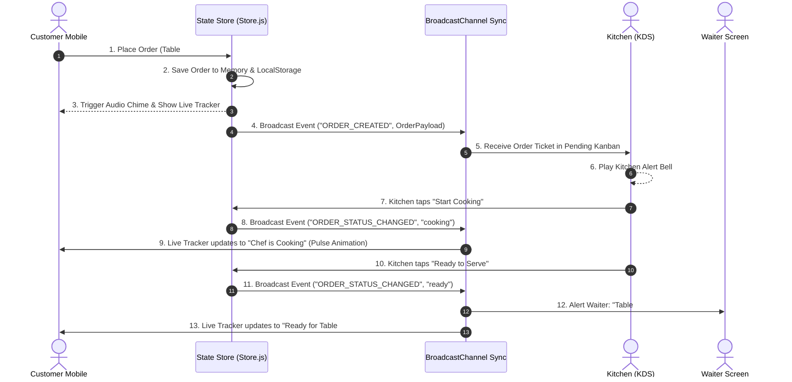

# System Architecture Document
## Project: FastMobile - Mobile Restaurant Platform

---

## 1. System Architecture Overview

FastMobile uses a modular, event-driven architecture designed to operate with high efficiency on mobile devices.

```
                   +---------------------------------------+
                   |           CUSTOMER MOBILE WEB         |
                   | - Table QR Scanner & Selector         |
                   | - Category Filter & Search           |
                   | - Interactive Dish Modal              |
                   | - Floating Cart & Quick Checkout      |
                   | - Live Order Step Progress Tracker    |
                   | - Waiter Call & Request Bill Button   |
                   +-------------------+-------------------+
                                       |
                                       v
                   +---------------------------------------+
                   |       REACTIVE STATE & EVENT STORE    |
                   | - State Management (Store.js)        |
                   | - Event Bus & Subscriptions          |
                   | - Audio Synth Feedback (Audio.js)    |
                   | - BroadcastChannel ("fastmobile_sync")|
                   +---------+-------------------+---------+
                             |                   |
                             v                   v
      +----------------------+-----+       +-----+------------------------+
      |  KITCHEN DISPLAY SYSTEM     |       |  WAITER DISPATCH & ADMIN    |
      |  (KDS TABLET VIEW)         |       |  DASHBOARD VIEW              |
      | - Live Kanban Ticket Board |       | - Staff Call Notifications   |
      | - Order Prep Timer & Alert |       | - Menu Manager & Out-of-Stock|
      | - Stage Transition Buttons |       | - Real-time Sales Analytics  |
      +----------------------------+       +------------------------------+
```

---

## 2. Real-Time Event Bus & Data Synchronization Flow



---

## 3. View Routing & Navigation Architecture

FastMobile utilizes a single-page hash routing mechanism (`#menu`, `#tracker`, `#kds`, `#admin`) for instant view transitions without full page reloads.

- `#menu`: Default customer view showcasing categories, dish grid, floating cart button, and bottom navbar.
- `#tracker`: Customer order tracking page displaying animated progress stages and live countdown.
- `#kds`: Kitchen Display System board for chefs.
- `#admin`: Restaurant management suite for updating menu, pricing, stock availability, and analytics.

---

## 4. Component Structure & Hierarchy

```
App Shell (index.html)
├── Top Navigation Header
│   ├── Restaurant Branding & Table Selector (#04)
│   ├── Quick View Switcher (Customer / KDS / Admin)
│   └── Live Cart Badge Trigger
├── Main View Container
│   ├── View: Menu
│   │   ├── Category Pills Carousel
│   │   ├── Filter & Search Bar (Veg/Spicy/Search)
│   │   └── Dish Card Grid
│   ├── View: Order Tracker
│   │   ├── Progress Stepper (Placed -> Prep -> Cooking -> Ready -> Served)
│   │   ├── Active Order Ticket Summary
│   │   └── Staff Call Action (Water / Waiter / Bill)
│   ├── View: KDS (Kitchen)
│   │   ├── Stage Columns (Pending, Preparing, Ready, Served)
│   │   └── Interactive Kitchen Tickets
│   └── View: Admin
│       ├── Daily Stats Widget
│       ├── Menu Management Form & List
│       └── Waiter Call Center Log
├── Modals & Drawers
│   ├── Customization Modal (Dish Add-ons)
│   └── Slide-up Cart Drawer (Mobile Thumb Reach)
└── Bottom Mobile Navigation Dock
```
